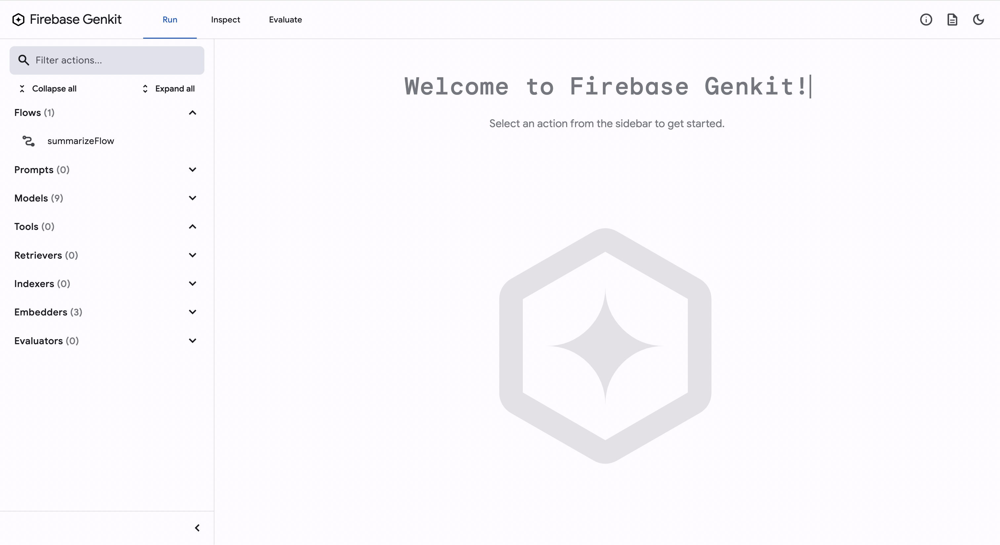
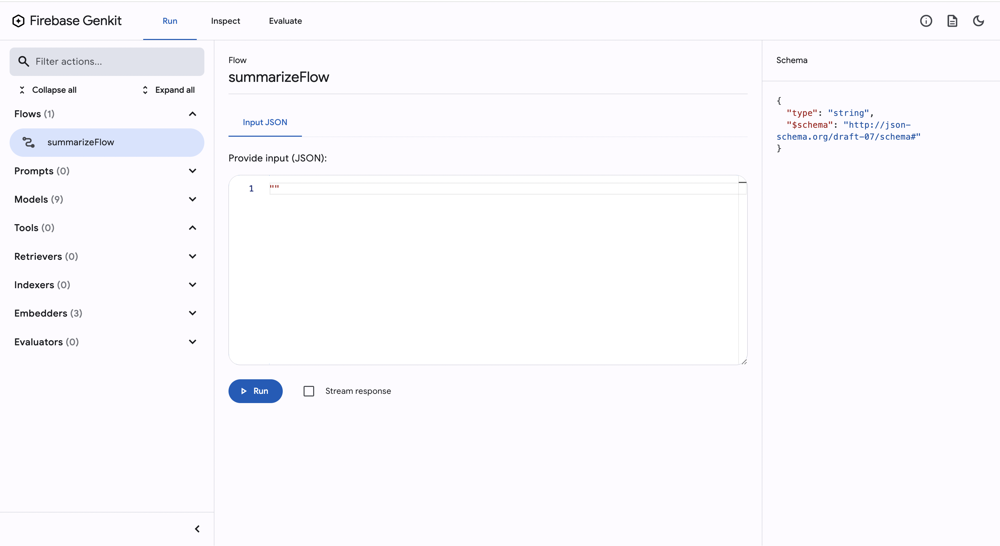
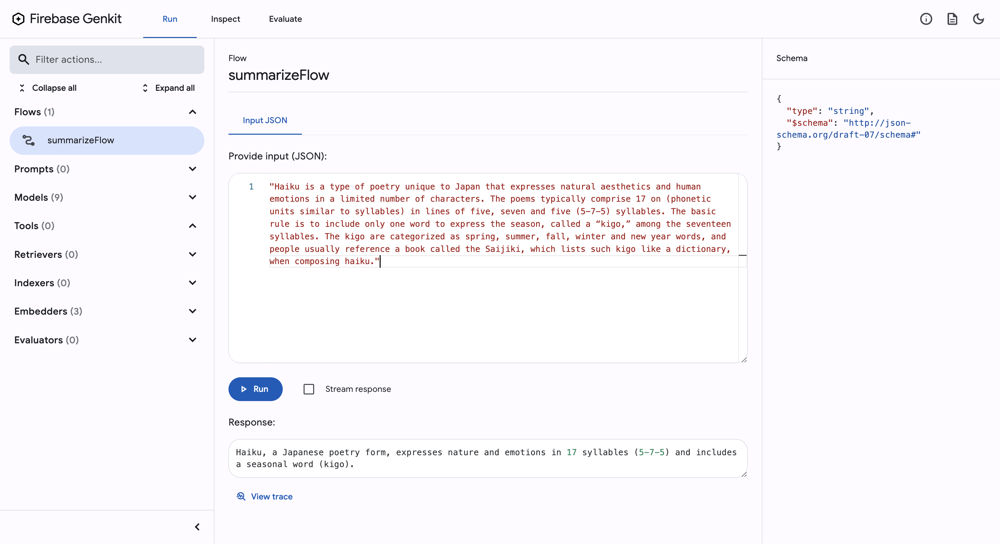
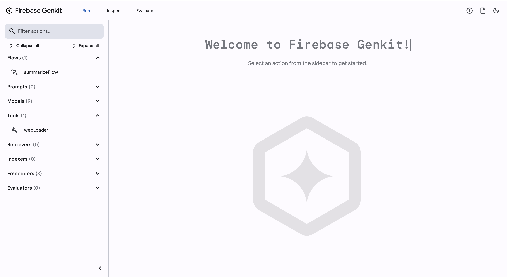
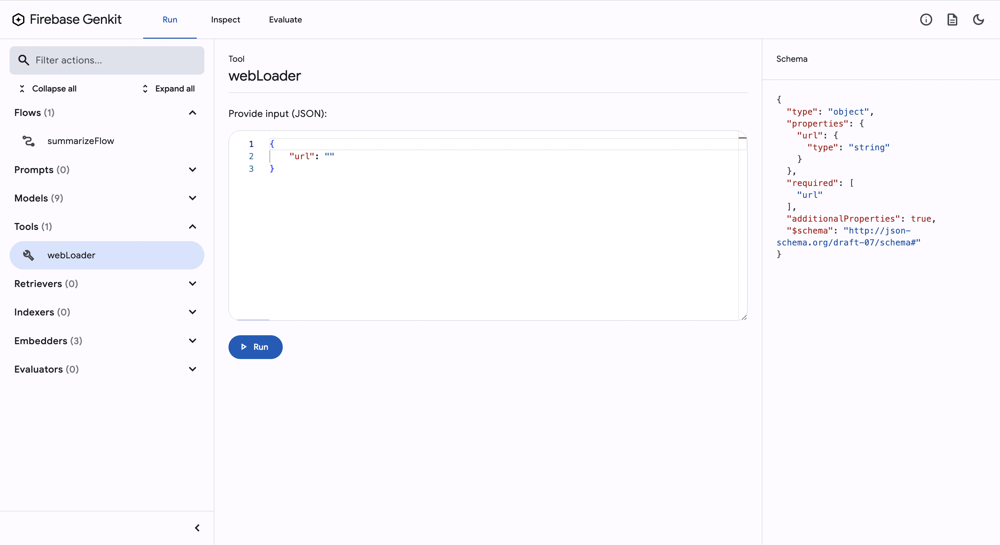
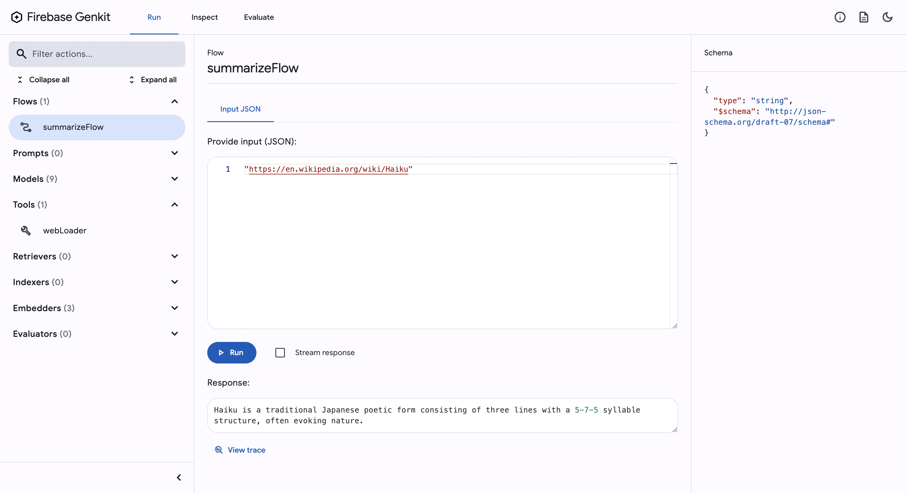
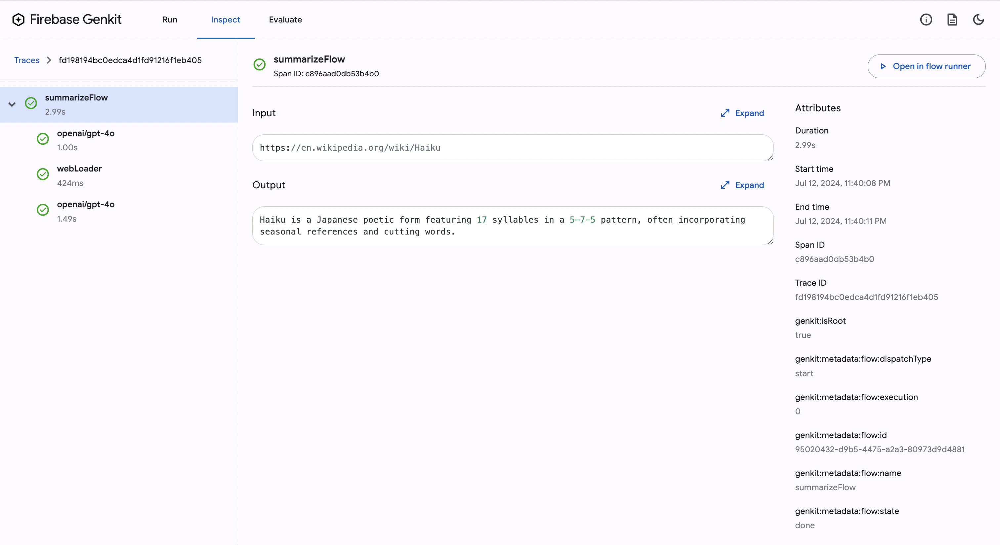

# Your First Guide to Getting Started with Firebase Genkit

[Firebase Genkit](https://firebase.google.com/products/genkit) is an open-source framework that helps developers create AI-powered applications.

In this tutorial, we'll explore Firebase Genkit, covering its basic principles and demonstrating how it can enhance your development process.

## Quick Start for the Impatient

If you're eager to dive right into Firebase Genkit without wading through the details, we've got you covered. Jumpstart your journey with the [genkit-sample](https://github.com/yukinagae/genkit-sample) project.

This sample project is your fastest route to experiencing Firebase Genkit in action. Follow these steps to get up and running in no time:

1. **Clone the Repository**: Start by cloning the genkit-sample repository to your local machine.

```bash
$ git clone https://github.com/yukinagae/genkit-sample.git
```

2. **Install Dependencies**: Navigate into the cloned directory and install the necessary dependencies.

```bash
$ cd genkit-sample
$ npm install
```

3. **Set Up Your API Key**: Before you can interact with Firebase Genkit, you'll need to set your OPENAI_API_KEY environment variable. This key enables your application to communicate with OpenAI's services.

```bash
$ export OPENAI_API_KEY=your_api_key
```

4. **Launch the Project**: With your API key in place, kickstart the Genkit server.

```bash
$ npm run genkit
```

This command fires up your project and opens it in your default web browser http://localhost:4000.
There you have it! A straightforward path to experiencing Firebase Genkit without the deep dive.

## A Beginner's Guide to Exploring Firebase Genkit

For those new to Firebase Genkit and eager to learn more about what it can do, this section is just for you. We'll walk you through some simple steps to get you started with Firebase Genkit, making it easy and fun to explore its features.

### 1. Setting Up Genkit

First things first, we need to configure Genkit settings.

```typescript
import { genkit, z } from "genkit";
import { gpt4o, openAI } from "genkitx-openai";

// Log debug output to the console.
import { logger } from "genkit/logging";
logger.setLogLevel("debug");

const ai = genkit({
  // Use the OpenAI plugin with the provided API key.
  // Ensure the OPENAI_API_KEY environment variable is set before running.
  plugins: [openAI({ apiKey: process.env.OPENAI_API_KEY })],
});
```

In the sample project, we leverage the OpenAI model to dynamically generate content.

**Note:** While the `OPENAI_API_KEY` environment variable is explicitly set in the code snippet above, the OpenAI model is designed to implicitly recognize the `OPENAI_API_KEY` environment variable.

```typescript
// Implicit usage
plugins: [openAI()],

// Explicit usage
plugins: [openAI({ apiKey: process.env.OPENAI_API_KEY })],
```

### 2. Creating Your First Flow

A "flow" is just a fancy way of saying the steps your app will take to do something cool. We'll show you how to set up a simple flow that you can build on as you learn more.

```typescript
import { gpt4o, openAI } from "genkitx-openai";

export const summarizeFlow = ai.defineFlow(
  {
    name: "summarizeFlow",
    inputSchema: z.string(),
    outputSchema: z.string(),
  },
  async (content: string) => {
    const llmResponse = await ai.generate({
      prompt: `Summarize the ${content} within 20 words.`,
      model: gpt4o, // Specify the model to use for generation
      tools: [],
      config: {
        temperature: 1, // Set the creativity/variation of the response
      },
    });

    return llmResponse.text;
  }
);
```

**NOTE:** While adhering to the [Firebase Genkit - Get started](https://firebase.google.com/docs/genkit/get-started) guide, it suggests that `startFlowsServer();` must be invoked at the end of your code. Interestingly, initiating the Genkit server operates successfully even in the absence of this call.

### 3. Launching the Genkit Server

With your first flow ready, it's time to see it in action! We'll guide you through starting the Genkit server so you can see your flow come to life.

To launch Firebase Genkit and explore its graphical user interface, execute one of the following commands in your terminal:

```bash
$ genkit start -o -- npx tsx src/index.ts
# or
$ npm run genkit
```

After running the command, navigate to http://localhost:4000 in your web browser to interact with the Firebase Genkit GUI.



**Note:** Should you encounter the error message `Error: please pass in the API key or set the OPENAI_API_KEY environment variable`, it indicates that the `OPENAI_API_KEY` has not been properly configured.

### 4. Run Your Flow

In the guide's left sidebar, locate the `Flow` section and select the `summarizeFlow` flow.



Proceed to input the following prompt into `Provide input (JSON):`:

```json
"Haiku is a type of poetry unique to Japan that expresses natural aesthetics and human emotions in a limited number of characters. The poems typically comprise 17 on (phonetic units similar to syllables) in lines of five, seven and five (5-7-5) syllables. The basic rule is to include only one word to express the season, called a “kigo,” among the seventeen syllables. The kigo are categorized as spring, summer, fall, winter and new year words, and people usually reference a book called the Saijiki, which lists such kigo like a dictionary, when composing haiku."
```

(This excerpt is sourced from: [Matsuo Basho: The Unparalleled Haiku Poet](https://www.gov-online.go.jp/eng/publicity/book/hlj/html/202205/202205_12_en.html))

After entering the prompt, click the `Run` button. You should observe an output similar to the following:

```text
Haiku, a Japanese poetry form, expresses nature and emotions in 17 syllables (5-7-5) and includes a seasonal word (kigo).
```



Congratulations, your setup is correctly configured and operational!

### 5. Adding More to Your Flow

Once you're comfortable with your basic flow, we'll help you add more to it. This could be new steps, or "tools," to make your app do even more interesting things.

The step involves defining a new tool, `webLoader`, which is responsible for fetching web content. This tool is a stateless function that takes a URL as input and returns the textual content of the webpage.

```typescript
const webLoader = ai,defineTool(
  {
    name: "webLoader",
    description: "Loads a webpage and returns the textual content.",
    inputSchema: z.object({ url: z.string() }),
    outputSchema: z.string(),
  },
  async ({ url }) => {
    // Fetch the content from the provided URL
    const res = await fetch(url);
    const html = await res.text();
    // Load the HTML content into Cheerio for parsing
    const $ = cheerio.load(html);

    // Remove unnecessary elements
    $("script, style, noscript").remove();

    // Prefer 'article' content, fallback to 'body' if not available
    return $("article").length ? $("article").text() : $("body").text();
  }
);
```

After defining the `webLoader` tool, the next step is to incorporate it into your existing flow, `summarizeFlow`. This flow is designed to summarize web content, leveraging the `webLoader` to fetch the content based on a URL input.

```typescript
import { gpt4o, openAI } from "genkitx-openai";

export const summarizeFlow = ai.defineFlow(
  {
    name: "summarizeFlow",
    inputSchema: z.string(),
    outputSchema: z.string(),
  },
  async (url: string) => {
    const llmResponse = await ai.generate({
      prompt: `First, fetch this link: "${url}". Then, summarize the content within 20 words.`,
      model: gpt4o, // Specify the model to use for generation
      tools: [webLoader], // Include the webLoader tool defined earlier for fetching webpage content
      config: {
        temperature: 1, // Set the creativity/variation of the response
      },
    });

    return llmResponse.text;
  }
);
```

In the updated flow, you'll notice a few key modifications that enhance its functionality.

**Argument Modification**

The function's argument has been updated to better align with its new purpose:

```typescript
// Before modification
async (content: string) => {

// After modification
async (url: string) => {
```

This change shifts the focus from processing direct content to working with URLs, allowing for dynamic content fetching.

**Prompt Update**

The prompt has been refined to incorporate the new argument type and streamline the task:

```typescript
// Before modification
prompt: `Summarize the ${content} within 20 words.`,

// After modification
prompt: `First, fetch this link: "${url}". Then, summarize the content within 20 words.`,
```

This adjustment not only specifies the action of fetching content from a URL but also challenges the model to provide a concise summary within a tighter word limit.

**Tool Integration**

A significant addition to the flow is the integration of a new tool, enhancing its capability to fetch and process web content:

```typescript
// Before modification
// (No tools specified)

// After modification
tools: [webLoader], // Include the webLoader tool defined earlier for fetching webpage content
```

By incorporating the webLoader tool, the flow now supports fetching content directly from the specified URL, enabling a more versatile and automated process.

These modifications collectively transform the flow, expanding its utility and efficiency in processing and summarizing web content.

### 6. Running Your Enhanced Flow

After enhancing your flow with additional features, it's crucial to test its functionality. You can either restart the Genkit Server or simply refresh your browser if the server is already running.

Upon refreshing, you'll observe the `webLoader` tool now listed in the left sidebar. Clicking on this tool will navigate you to its input page, showcasing one of Genkit GUI's standout features: the ability to individually run and test each tool's functionality.



Testing with an invalid URL:

```json
{
  "url": "https://not-found"
}
```



As expected, an error occurs.

```text
TRPCClientError: fetch failed
    at n.from (http://localhost:4000/main-ZS4I5FPL.js:17:525025)
    at http://localhost:4000/main-ZS4I5FPL.js:17:529028
    at u.invoke (http://localhost:4000/polyfills-QXL6O4PO.js:16:6385)
    at Object.onInvoke (http://localhost:4000/chunk-HQANKQXH.js:22:79656)
    at u.invoke (http://localhost:4000/polyfills-QXL6O4PO.js:16:6325)
    at Y.run (http://localhost:4000/polyfills-QXL6O4PO.js:16:1715)
    at http://localhost:4000/polyfills-QXL6O4PO.js:17:554
    at u.invokeTask (http://localhost:4000/polyfills-QXL6O4PO.js:16:7010)
    at Object.onInvokeTask (http://localhost:4000/chunk-HQANKQXH.js:22:79472)
    at u.invokeTask (http://localhost:4000/polyfills-QXL6O4PO.js:16:6931)
```

Conversely, using a valid URL:

```json
{
  "url": "https://en.wikipedia.org/wiki/Haiku"
}
```

This time, the tool successfully retrieves content, demonstrating its capability to fetch and process web data:

```text
"Jump to content\n\n\t\n\t\t\n\t\t\t\n\t\t\t\t\n\n\t\n\t\n\nMain menu\n\t\n\t\n\n\n\t\t\t\t\n\t\t\n\n\t\n\tMain menu\n\tmove to sidebar\n\thide\n\n\n\t\n\n\t\n\t\tNavigation\n\t\n\t\n\t\t\n\t\t\n\t\t\t\n\t\t\tMain pageContentsCurrent eventsRandom articleAbout WikipediaContact usDonate\n\t\t\n\t\t\n\t\n\n\n\t\n\t\n\n\t\n\t\tContribute\n\t\n\t\n\t\t\n\t\t\n\t\t\t\n\t\t\tHelpLearn to editCommunity portalRecent changesUpload
```

To further validate the flow's effectiveness, let's input a direct URL into the summarizeFlow:

```json
"https://en.wikipedia.org/wiki/Haiku"
```

The result is a concise and informative summary, highlighting the flow's ability to distill key information:

```text
Haiku is a traditional Japanese poetic form consisting of three lines with a 5-7-5 syllable structure, often evoking nature.
```



Finally, to gain insights into how the flow processes your input, click on the `Inspect` section in the header. The trace will reveal that the flow employs the `webLoader` tool to fetch the content, showcasing the step-by-step execution of your flow.



Now that you're familiar with the basics, feel free to explore and experiment with the flow and tools further. For a practical starting point, consider checking out [genkit-sample](https://github.com/yukinagae/genkit-sample) to run Firebase Genkit for educational purposes.

Enjoy!
